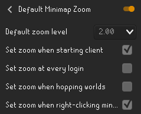

# Default Minimap Zoom
Also annoyed by having to zoom out or in every time you restart the client? 

**Default Minimap Zoom allows the user to set the default minimap zoom**, so they don't always have to zoom in or out when starting RuneLite.
The currently active zoom level will also be changed while changing the config value, so you can see what you are setting your default minimap zoom to.

Via config, the default zoom value can be applied... 
- when starting the client,
- on every login,
- or when hopping worlds.

Please make sure "Zoom" is enabled in the Minimap plugin and make sure that the Minimap plugin is enabled as well if you wish this plugin to set the default zoom level!

Example config of being maximally zoomed out when starting the client:
 

If you experience any issues or have any concerns, please reach out to YvesW via a GitHub Issue, by Discord direct messaging or via the RuneLite Discord by mentioning @Yves W.